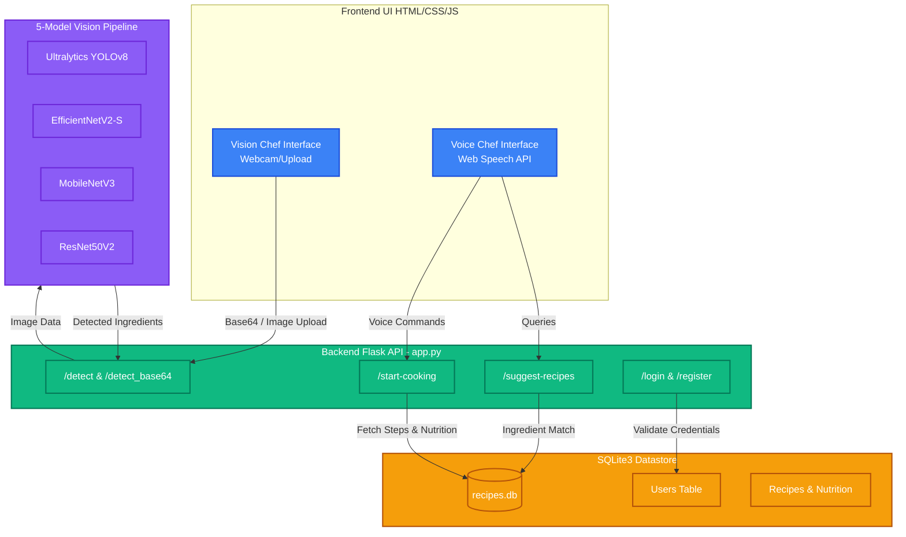

# 🍽️ Recipe Lens — AI Kitchen Assistant

**Recipe Lens** is a full-stack web app that helps you cook using two AI-powered modes:

- 🎙️ **Voice Chef** — Speak your ingredients, pick a recipe, and get step-by-step voice-guided cooking instructions.
- 📷 **Vision Chef** — Upload a photo or use your webcam; the app automatically detects ingredients using a 5-model AI pipeline and suggests matching recipes.

---

## 🚀 Features

| Feature | Details |
|---|---|
| **Multi-Model Detection** | YOLOv8s, YOLOv8n-OIV7, EfficientNetV2-S, MobileNetV3, ResNet50V2 |
| **Voice Recognition** | Web Speech API (en-IN / en-US), continuous listening, smart chunked TTS |
| **Recipe Suggestions** | SQLite-backed ingredient → recipe matching, top-8 results |
| **Nutrition Info** | Per-ingredient kcal, macros (protein, carbs, fat), key vitamins |
| **Step-by-Step Cooking** | Recipe modal with progress bar, step dots, voice narration, built-in timer |
| **Serving Scaler** | Dynamically adjusts ingredient quantities to your serving count |
| **Auth** | Register / Login with SQLite users table |
| **Webcam Capture** | Live camera capture → base64 detection pipeline |

---

## 🛠️ Tech Stack

- **Frontend:** HTML5, CSS3, Vanilla JavaScript (Web Speech API, MediaDevices API)
- **Backend:** Python 3, Flask, Flask-CORS
- **AI / ML:** TensorFlow/Keras (EfficientNet, MobileNet, ResNet), Ultralytics YOLOv8
- **Database:** SQLite3 (`recipes.db`)

---

## 🏗️ Architecture



---

## 📂 Project Structure

```
recipe-lens/
├── backend/
│   ├── app.py               # Main Flask server — all API routes
│   ├── detector.py          # 5-model vision pipeline (YOLO + classifiers)
│   ├── utils.py             # Recipe DB queries & ingredient matching
│   ├── database_setup.py    # One-time DB initialisation script
│   ├── nutrition_data.py    # Nutrition info for ingredients
│   ├── recipe_logic.py      # Recipe fetching & step logic
│   └── voice_cook.py        # Voice cooking helper
├── frontend/home/
│   ├── home.html            # Landing page
│   ├── voice_chef.html      # Voice Chef UI
│   ├── vision.html          # Vision Chef UI
│   ├── Login.html           # Login / Register page
│   ├── aboutus.html         # About Us page
│   ├── workflow.html        # How it works page
│   ├── voice.js             # Voice Chef logic (speech, TTS, recipe flow)
│   ├── vision.js            # Vision Chef logic (detection, results, drawer)
│   ├── style_voice.css      # Voice Chef styles
│   └── style_vision.css     # Vision Chef styles
├── requirements.txt         # Python dependencies
└── README.md
```

---

## ⚙️ Setup & Run

### 1. Clone the repo
```bash
git clone <repo-url>
cd recipe-lens
```

### 2. Create a virtual environment & install dependencies
```bash
python -m venv venv

# Windows
venv\Scripts\activate

# Mac / Linux
source venv/bin/activate

pip install -r requirements.txt
```

> **Note:** First run will auto-download YOLO and Keras model weights (~500 MB). This only happens once.

### 3. Initialise the database
```bash
cd backend
python database_setup.py
```

### 4. Start the server
```bash
python app.py
```

Open **http://localhost:5000** in your browser.

---

## 🗺️ API Endpoints

| Method | Route | Purpose |
|---|---|---|
| POST | `/detect` | Vision Chef — detect ingredients from uploaded image |
| POST | `/detect_base64` | Vision Chef — detect from webcam base64 image |
| POST | `/suggest-recipes` | Get top matching recipes for a list of ingredients |
| POST | `/start-cooking` | Load steps + nutrition for a recipe by index |
| POST | `/start-cooking-by-name` | Load steps + nutrition for a recipe by name |
| POST | `/register` | Register a new user |
| POST | `/login` | Log in an existing user |

---

## 👥 Team Notes

- **Do not commit** `venv/`, `recipes.db`, `backend/uploads/`, `backend/results/`, or any large model weight folders — these are all in `.gitignore`.
- If you add new recipes, run `database_setup.py` again to rebuild the DB.
- If you add new Python packages, update `requirements.txt` with `pip freeze > requirements.txt`.
- The Voice Chef front-end uses `continuous: true` speech recognition — make sure your browser allows microphone access.
- The Vision Chef detection can take **2–30 seconds** depending on image size and whether models are warm.
